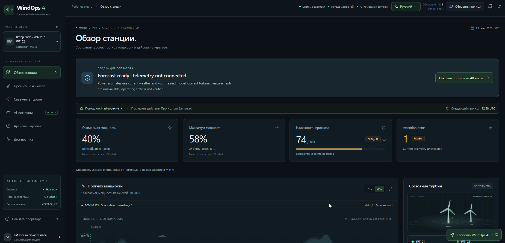
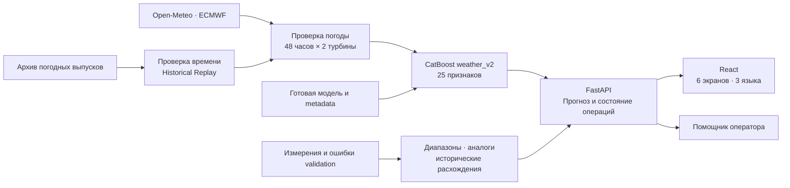

# WindOps AI



<p align="center">
  <strong>Predict. Understand. Act.</strong><br>
  Прогноз мощности ветропарка, объяснения модели и рабочее место оператора.<br>
  English · Русский · Қазақша
</p>

**WindOps AI** объединяет исследование данных двух ветротурбин, погодную модель CatBoost, серверную автоматизацию и веб-интерфейс. Система получает прогноз погоды ECMWF через Open-Meteo, рассчитывает мощность на 48 часов и помогает оператору разобраться в ожидаемой выработке, диапазонах и причинах изменения прогноза.

|      Турбины      |        Горизонт         | Исходные измерения  |        Интерфейс        |
| :---------------: | :---------------------: | :-----------------: | :---------------------: |
| **WT-01 и WT-02** | **48 часов**, шаг 1 час | **291 859** записей | **6 экранов · 3 языка** |

[Возможности](#features) · [Что мы сделали](#work) · [Архитектура](#architecture) · [Модель и результаты](#model) · [Демонстрация](#demo)

[Запуск](#quick-start) · [Данные и настройки](#artifacts) · [Разработчикам](#development) · [Проверки](#checks) · [Границы версии](#limits)

<a id="features"></a>

## Возможности

Панель показывает ожидаемую мощность, время пика, погодные условия и доступность источников. Из графика можно перейти к объяснению конкретного часа, сравнить турбины и посмотреть, какие действия выполнил сервер.

| Экран                                                                                  | Что можно сделать                                                                                                                             |
| -------------------------------------------------------------------------------------- | --------------------------------------------------------------------------------------------------------------------------------------------- |
| **[Обзор / Overview](frontend/src/pages/Overview.tsx)**                                | Увидеть сводку для оператора, среднюю ожидаемую мощность на ближайшие 6 часов, пик, прогноз 24/48 часов, карточки турбин и последние события. |
| **[Прогноз / Forecast](frontend/src/pages/Forecast.tsx)**                              | Сравнить WT-01 и WT-02, посмотреть ветер на высотах 10/80/120 м, открыть объяснение точки и выгрузить прогноз в CSV.                          |
| **[Сравнение турбин / Turbine Twin](frontend/src/pages/TurbineTwin.tsx)**              | Сопоставить ожидаемую мощность, последние архивные измерения и найденные исторические расхождения.                                            |
| **[AI Agent](frontend/src/pages/Agent.tsx)**                                           | Запустить обновление, проследить получение погоды, проверку данных, расчёт модели и публикацию результата в журнале событий.                  |
| **[Исторический расчёт / Historical Replay](frontend/src/pages/HistoricalReplay.tsx)** | Воспроизвести прогноз из архивного погодного выпуска с проверкой временных границ входных данных.                                             |
| **[Диагностика / Diagnostics](frontend/src/pages/Diagnostics.tsx)**                    | Проверить метрики, объём датасетов, версию и SHA-256 модели, источники и составляющие индикатора надёжности.                                  |

**Помощник оператора** отвечает на вопросы о пике мощности, ветре, сравнении турбин, изменениях прогноза и его надёжности. Ответы рассчитываются на сервере по опубликованному прогнозу. Подключение внешней языковой модели NVIDIA доступно через настройки.

**Интерфейс:** тёмная тема, интерактивные графики, визуализация турбин, уведомления, настройки, управление с клавиатуры и поддержка уменьшенной анимации. Адаптивная вёрстка рассчитана на телефон, планшет и большой экран; браузерные проверки охватывают ширины от 360 до 1920 px. Язык переключается без повторного расчёта прогноза.

> Фактические показания турбин можно подключить через обновляемый CSV/JSON или входящий API. Пока источник свежих измерений не предоставлен, текущая мощность недоступна; архив показан отдельно с датой. [Инструкция подключения](docs/TELEMETRY.md).

<a id="work"></a>

## Что мы сделали

Работа охватывает весь путь от исходных CSV до панели с работающим Python API.

1. **Подготовили измерения турбин.** Обработали 142 360 записей WT-01 и 149 499 записей WT-02: привели даты и числа к единому формату, удалили дубли времени, перевели десятиминутные наблюдения в почасовые. Часы с менее чем тремя измерениями исключаются из обучения.
2. **Исследовали зависимость мощности от условий.** Построили исходную модель по измеренным ветру и температуре, добавили признаки турбины и циклические признаки времени. Этот этап позволил оценить поведение оборудования по фактическим условиям.
3. **Собрали погодный обучающий набор.** Совместили исторические выпуски ECMWF с измеренной мощностью и временем принятия решения. Для погодной модели подготовлены 60 118 строк и 666 моментов расчёта.
4. **Обучили модель для прогнозирования вперёд.** CatBoost `weather_v2` использует 25 признаков, включая ветер на разных высотах, направления, сдвиг ветра, горизонт и календарные циклы. Обучение и проверка разделены по времени с исключением пограничного дня.
5. **Сравнили общую и отдельные модели турбин.** Сохранили результаты отдельного эксперимента с разделением train/tune/test. В приложении используется общая погодная модель с идентификатором турбины.
6. **Добавили объяснения и работу с архивом.** Реализовали вклады факторов CatBoost SHAP, поиск похожих исторических условий, диапазоны по ошибкам validation и воспроизведение прогнозов из сохранённых погодных выпусков.
7. **Соединили исследование с сервисом.** Подключили готовые артефакты к FastAPI, фоновый расчёт, обновление по расписанию, проверку входов, предыдущий погодный выпуск и локальный кэш при сбое. Добавили тест совпадения с исходным экспортом прогнозов с допуском `1e-12`.
8. **Собрали рабочее место оператора.** Реализовали шесть экранов React, графики, CSV, помощника, уведомления, русский, казахский и английский языки. Покрыли ключевые сценарии проверками API, модели, переводов и браузера; объединили запуск backend и frontend одной командой.

<details>
<summary><strong>Исследовательские этапы и исходные скрипты</strong></summary>

Исследовательский пакет находится в `task/`. Скрипты обучения и экспорта запускаются отдельно; обычный запуск приложения загружает готовую модель.

| Этап                         | Код                                                                                                                | Результат                                                                       |
| ---------------------------- | ------------------------------------------------------------------------------------------------------------------ | ------------------------------------------------------------------------------- |
| Подготовка измерений         | [prepare_data.py](task/prepare_data.py)                                                                            | Почасовые данные, контроль наполненности часа, временные признаки.              |
| Исходная модель по датчикам  | [train_model.py](task/train_model.py)                                                                              | Модель зависимости мощности от фактических ветра и температуры.                 |
| Проверка входов двух турбин  | [check_turbines.py](task/check_turbines.py)                                                                        | Сопоставление погодных признаков для двух площадок.                             |
| Сбор погодного архива        | [weather_backtest.py](task/weather_backtest.py), [download_weather_training.py](task/download_weather_training.py) | Выпуски ECMWF, временные окна и сохранённые ответы источника.                   |
| Совмещение погоды и мощности | [merge_weather_power.py](task/merge_weather_power.py)                                                              | `training_v2.csv`, согласование времени и подготовка погодных признаков.        |
| Обучение погодной модели     | [train_model_v2.py](task/train_model_v2.py)                                                                        | Веса CatBoost, metadata, прогнозы validation и метрики.                         |
| Сравнение подходов           | [compare_turbine_models.py](task/compare_turbine_models.py)                                                        | Общая модель и две отдельные модели на одинаковом экспериментальном разделении. |
| Архивный экспорт             | [predict_february.py](task/predict_february.py)                                                                    | Февральские прогнозы, используемые также для проверки нового inference.         |

Команды исследовательских скриптов выполняются из `task/`, поскольку часть путей задана относительно этой папки. Повторное обучение и сбор архива создают новые артефакты; для просмотра панели они не нужны.

</details>

<a id="architecture"></a>

## Как работает система



При запуске сервер загружает модель и данные, получает доступный выпуск погоды и рассчитывает **96 значений мощности: 48 часов для каждой турбины**. По умолчанию обновление повторяется раз в час; его также можно запустить из интерфейса.

Проверяются обе площадки, единицы измерения, последовательность всех часов, пропуски и допустимые значения. Если выпуск недоступен, сервер запрашивает предыдущий, затем проверяет локальный погодный кэш возрастом до 18 часов. При полном сбое последний опубликованный прогноз сохраняется с отметкой устаревания, а повторная попытка назначается через 5 минут.

Прогноз, карточки турбин и состояние операций публикуются согласованно. Интерфейс получает снимок через `GET /api/operations`: раз в 1,5 секунды во время расчёта и раз в 5 секунд в ожидании. Повторное нажатие обновления во время расчёта не создаёт второй параллельный запуск.

<a id="model"></a>

## Модель и результаты

Рабочая модель — **CatBoostRegressor `weather_v2`**. Цель — нормализованная мощность в диапазоне **0–1**; интерфейс показывает её в процентах номинальной мощности. Показатели мощности не выражают энергию в МВт·ч.

| Выборка         | MAE, п.п. номинальной мощности | RMSE, п.п. |        R² |
| --------------- | -----------------------------: | ---------: | --------: |
| **Обе турбины** |                      **18,28** |  **23,80** | **0,582** |
| WT-01           |                          17,88 |      23,23 |     0,598 |
| WT-02           |                          18,69 |      24,35 |     0,566 |

Источник значений — [metadata погодной модели](task/models/catboost_weather_metadata.json). Это результаты отложенной проверки; финальная модель для приложения затем обучена на всём доступном наборе. При старте сервера переобучление не выполняется.

<details>
<summary><strong>Обучающие данные, 25 признаков и разделение по времени</strong></summary>

- **60 118 строк**, **666 моментов расчёта**; период целевых измерений — с 2 апреля 2024 по 31 января 2026.
- **1 признак** турбины: `turbine`.
- **7 погодных признаков:** температура, влажность, давление, скорость ветра на 10/80/120 м и порывы на 10 м.
- **6 признаков направления:** синус и косинус направления ветра на каждой из трёх высот.
- **5 производных признаков ветра:** три разности скоростей между высотами и куб скорости на 80/120 м.
- **6 временных признаков:** час горизонта, время от выпуска погоды, синус и косинус часа суток и дня года.

Даты решений для train заканчиваются **18 января 2026**. **19 января** исключается как пограничный день; validation начинается **20 января**. Скрипт проверяет отсутствие одинаковых пар «целевой час + турбина» в train и validation.

Измеренные `actual_wind_speed` и `actual_temperature` исключены из входов погодной модели: в момент будущего прогноза эти значения ещё неизвестны. Порядок признаков проверяется по metadata при загрузке весов.

Временные признаки вычисляются в **Asia/Almaty**, как при обучении; API и операторские графики используют **UTC**.

</details>

<details>
<summary><strong>Исходная модель по датчикам и сравнение моделей турбин</strong></summary>

Исходная модель с семью признаками описывает мощность по **измеренным** ветру и температуре. На январской validation её MAE — **2,33 п.п.**, RMSE — **5,55 п.п.**, R² — **0,973**. Эти результаты относятся к задаче с известными фактическими условиями; качество прогноза будущей мощности оценивается по погодной модели в основной таблице.

Отдельно сравнили общую погодную модель и две модели, обученные по каждой турбине:

| Подход                              | MAE, п.п. | RMSE, п.п. |    R² |
| ----------------------------------- | --------: | ---------: | ----: |
| Общая модель с признаком турбины    |     18,17 |      23,88 | 0,589 |
| Отдельная модель для каждой турбины |     18,32 |      23,84 | 0,590 |

В этом эксперименте train заканчивается 10 января, tune охватывает 12–17 января, test начинается 19 января; 11 и 18 января исключены. Разница MAE составляет около 0,15 п.п. в пользу общей модели. Значения относятся к этому экспериментальному разделению.

Артефакты: [исходная модель](task/models/model_metadata.json), [результаты сравнения](task/models/turbine_model_comparison.json).

</details>

<details>
<summary><strong>Как устроены объяснения, диапазоны и индикатор надёжности</strong></summary>

| Механизм                 | Расчёт                                                                                                                           |
| ------------------------ | -------------------------------------------------------------------------------------------------------------------------------- |
| Объяснение часа          | CatBoost SHAP для выбранных турбины и времени. Показываются шесть наиболее значимых групп факторов, их знак и вклад.             |
| Диапазон мощности        | Прогноз ± 90-й процентиль абсолютной ошибки validation соответствующей турбины, с ограничением 0–1.                              |
| Исторические аналоги     | Ветер ±1,5 м/с, температура ±4 °C, направление ±45°. Измерения и момент решения должны предшествовать выбранному origin.         |
| Исторические расхождения | Разница мощности ≥20 п.п. при разнице ветра ≤0,8 м/с минимум два последовательных часа за последние 90 дней доступных измерений. |

**Индикатор надёжности** усредняет полноту погодных данных, `100 × (1 − MAE)` и свежесть выпуска. За отсутствие проверки поведения турбин и независимого сравнения погодных источников снимается по 10 баллов; использование кэша снимает ещё 10. Нижняя граница итоговой оценки — 0. Сам приём измерений ещё не подтверждает поведение оборудования и не повышает оценку.

Полнота прошедшей проверку погоды равна 100. Свежесть начинается со 100 и уменьшается на 5 баллов за каждый час после первых 6 часов от оценённого момента доступности выпуска; нижняя граница — 0.

Диапазон — эмпирическая оценка ошибок, индикатор — операторская эвристика. Они не задают откалиброванную вероятность точности. Историческое расхождение служит поводом для анализа и не устанавливает неисправность оборудования.

</details>

<a id="demo"></a>

## Сценарий демонстрации

1. **Откройте обзор.** Покажите ближайшие 48 часов, ожидаемый пик мощности, сводку оператора и доступность источников.
2. **Перейдите в прогноз.** Переключите 24/48 часов и турбину, выберите точку графика, откройте вклады факторов и похожие исторические периоды. Выгрузите CSV.
3. **Сравните турбины.** Покажите ожидаемую мощность и последние архивные измерения с датами.
4. **Запустите обновление в AI Agent.** Проследите реальные события запроса погоды, валидации, расчёта и публикации. Спросите помощника: «Когда ожидается пик мощности?»
5. **Выполните Historical Replay.** Выберите **3 февраля 2026, 08:00 UTC**. Используется выпуск **2 февраля, 12:00 UTC**, оценённое время доступности — **18:10 UTC** того же дня. Текущий прогноз на главной сохраняется.
6. **Откройте диагностику и смените язык.** Покажите метрики из файла модели, количество измерений, её версию и SHA-256, затем русский или казахский интерфейс.

<a id="quick-start"></a>

## Быстрый запуск

Нужны **Node.js 22.12+**, **Python 3.11+**, доступ к погодному API и исследовательские артефакты в `task/` рядом с `package.json`. Проверьте [состав данных](#artifacts), если используете копию проекта без больших файлов.

Все команды ниже выполняются из корня репозитория.

**Windows PowerShell — установка:**

```powershell
npm.cmd install
python -m venv backend/.venv
backend/.venv/Scripts/python.exe -m pip install -r backend/requirements.txt
```

**Запуск API и интерфейса одной командой:**

```powershell
npm.cmd run dev
```

| Адрес                                                         | Назначение                                                          |
| ------------------------------------------------------------- | ------------------------------------------------------------------- |
| [127.0.0.1:5173](http://127.0.0.1:5173)                       | Операторская панель. Если порт занят, смотрите адрес в выводе Vite. |
| [127.0.0.1:8000/docs](http://127.0.0.1:8000/docs)             | Интерактивная документация API.                                     |
| [127.0.0.1:8000/api/health](http://127.0.0.1:8000/api/health) | Доступность сервера и состояние загрузки модели.                    |

Первый прогноз появляется после загрузки артефактов и получения погоды. `Ctrl+C` останавливает оба процесса. Для публичных погодных запросов API-ключ не требуется.

<details>
<summary><strong>macOS / Linux</strong></summary>

```sh
npm install
python3 -m venv backend/.venv
backend/.venv/bin/python -m pip install -r backend/requirements.txt
npm run dev
```

</details>

<details>
<summary><strong>Отдельный запуск, сборка и частые вопросы</strong></summary>

| Команда из корня                      | Действие                                                     |
| ------------------------------------- | ------------------------------------------------------------ |
| `npm run dev:backend`                 | Только FastAPI на `127.0.0.1:8000`.                          |
| `npm run dev:frontend`                | Только Vite; `/api` проксируется на backend.                 |
| `npm run build`                       | Проверка TypeScript и сборка frontend в `dist/`.             |
| `npm run preview -- --host 127.0.0.1` | Локальный просмотр сборки; backend должен работать отдельно. |

В Windows при запрете PowerShell-скриптов используйте `npm.cmd` и `npx.cmd`.

| Ситуация                          | Что проверить                                                                                                                       |
| --------------------------------- | ----------------------------------------------------------------------------------------------------------------------------------- |
| Python или зависимости не найдены | Установлены ли `backend/requirements.txt` именно в `backend/.venv`; при другом интерпретаторе задайте `WINDOPS_PYTHON`.             |
| Модель или данные не загружаются  | Наличие файлов `task/`, значение `WINDOPS_TASK_DIR` и журнал backend. Сборка frontend не создаёт модель.                            |
| Нет первого прогноза              | Подождите завершения запроса погоды и откройте журнал AI Agent; без подходящих данных сервер сообщает об ошибке.                    |
| Интерфейс не видит API            | Доступен ли `/api/health` на порту 8000; запущены ли оба сервера.                                                                   |
| Архивная дата отклонена           | Дата должна быть позже границы обучения и покрываться сохранённым выпуском. Для демонстрации используйте `2026-02-03`, `08:00` UTC. |

</details>

<a id="artifacts"></a>

## Данные и настройки

Сервер читает готовые модели и исходные архивы из `task/`. Новые погодные снимки записываются в `storage/weather/live-runs/`, последний текущий прогноз — в `storage/forecasts/latest.json`.

<details>
<summary><strong>Обязательные артефакты и структура хранилища</strong></summary>

```text
task/
├── models/
│   ├── catboost_weather.cbm
│   ├── catboost_weather_metadata.json
│   └── weather_validation_predictions.csv
├── data/
│   ├── turbine_1.csv
│   ├── turbine_2.csv
│   └── processed/
│       ├── hourly_training.csv
│       └── training_v2.csv
├── weather_backtest/
│   └── <дата>/response.json
└── predictions/
    └── forecast_february.csv
```

Веса и metadata нужны для расчёта; ошибки validation — для диапазонов; CSV измерений — для диагностики и истории. `training_v2.csv` используется для похожих периодов, погодные архивы — для Historical Replay. `predictions/forecast_february.csv` нужен тесту совпадения с исходным экспортом.

Уже отслеживаемые файлы `task/` входят в репозиторий. Правила `.gitignore` исключают новые локальные артефакты и не удаляют существующие файлы из истории. Если ваш checkout не содержит перечисленные данные, их нужно получить отдельно.

Рабочее хранилище `storage/` также содержит каталоги `data/raw/`, `data/processed/`, `models/`, `weather/`, `forecasts/` и `reports/`. Они используются для локальных результатов и ранних CLI-модулей. В Git сохраняются маркеры `.gitkeep`; рабочие результаты игнорируются.

Для раннего CLI подготовки исходные CSV размещаются в `storage/data/raw/`. Веб-сервис использует артефакты погодной модели из `task/`.

</details>

Для изменения настроек создайте `backend/.env` на основе [backend/.env.example](backend/.env.example). Сервер загружает его автоматически.

| Переменная                | По умолчанию | Назначение                                                                  |
| ------------------------- | ------------ | --------------------------------------------------------------------------- |
| `WINDOPS_TASK_DIR`        | `task`       | Каталог исследовательских данных, модели и архивов.                         |
| `WINDOPS_STORAGE_DIR`     | `storage`    | Каталог новых погодных снимков и результатов.                               |
| `WINDOPS_REFRESH_SECONDS` | `3600`       | Интервал обновления, минимум 300 секунд.                                    |
| `OPEN_METEO_API_KEY`      | Пусто        | Необязательный ключ платного аккаунта Open-Meteo.                           |
| `NVIDIA_API_KEY`          | Пусто        | Ключ внешнего языкового помощника.                                          |
| `NVIDIA_MODEL`            | Пусто        | Имя модели NVIDIA; внешний помощник включается, когда заданы оба параметра. |

Относительные пути настроек разрешаются от корня репозитория; поддерживаются абсолютные пути к внешнему хранилищу. **`WINDOPS_PYTHON`** выбирает другой Python для скриптов запуска и задаётся в окружении Node, отдельно от `backend/.env`.

Ключи используются только backend и не передаются в браузер. Без настроенной внешней модели помощник отвечает на предусмотренные темы по данным сервера; при ошибке внешнего сервиса также возвращается к этому режиму.

Для OpenAI задайте `OPENAI_API_KEY` в `backend/.env`; `OPENAI_MODEL` по умолчанию — `gpt-5.4-mini`. OpenAI имеет приоритет перед NVIDIA. После изменения `.env` перезапустите `npm run dev`: работающий сервер не перечитывает настройки автоматически.

Отдельный анализ прогноза можно запустить из корня проекта:

```powershell
node scripts/python.mjs task/ai_agent.py
```

Скрипт загружает `backend/.env`. Если исследовательский файл `task/predictions/live/forecast_live.json` отсутствует, он использует опубликованный сервером `storage/forecasts/latest.json` (с учётом `WINDOPS_STORAGE_DIR`), сохраняя прогноз мощности и временные метки. Сначала дождитесь расчёта прогноза в приложении. Устаревший, архивный или неполный серверный прогноз отклоняется до обращения к OpenAI. Результат сохраняется в `task/predictions/live/analysis_live.json`.

Для текущих показаний предусмотрены `WINDOPS_TELEMETRY_FILE` (путь к CSV/JSON), `WINDOPS_TELEMETRY_KEY` (отдельный секрет входящего API) и `WINDOPS_TELEMETRY_MAX_AGE_SECONDS` (1200 секунд по умолчанию). Форматы, команды и значения статусов описаны в [инструкции телеметрии](docs/TELEMETRY.md). Новый ключ не требует NVIDIA или OpenAI.

<a id="development"></a>

## Для разработчиков

| Часть            | Технологии                                                                               |
| ---------------- | ---------------------------------------------------------------------------------------- |
| Интерфейс        | React 19, TypeScript, Vite 7, Tailwind CSS 4, Radix UI, Recharts, Framer Motion, Lucide. |
| API и выполнение | Python, FastAPI, Uvicorn, requests, python-dotenv.                                       |
| Данные и модель  | CatBoost, pandas, NumPy, scikit-learn.                                                   |
| Проверки         | Vitest, Python unittest, FastAPI TestClient, Playwright, TypeScript.                     |

```text
frontend/
├── src/
│   ├── pages/          шесть экранов
│   ├── components/     графики, турбины, помощник и общие элементы
│   ├── services/       HTTP-клиент
│   ├── state/          согласованный снимок операций
│   ├── i18n/           языки и форматирование
│   ├── styles/         адаптивность и читаемость
│   ├── types/          контракты данных
│   └── lib/            функции отображения
└── tests/              браузерные сценарии
backend/
├── windops/
│   ├── api/            FastAPI, состояние и планировщик
│   ├── core/           настройки и пути
│   ├── data/           чтение артефактов и подготовка данных
│   ├── weather/        погодные выпуски и валидация
│   ├── ml/             обучение, inference и объяснения
│   └── agent/          ответы помощника
└── tests/              проверки Python и реальных артефактов
scripts/                совместный запуск Node и Python
task/                   исследовательский код и артефакты
storage/                локальные результаты
gif/                    демонстрация интерфейса
README.md               единая документация проекта
```

Состоянием и планировщиком управляет [runtime.py](backend/windops/api/runtime.py). [repository.py](backend/windops/data/repository.py) читает исследовательские файлы; [inference.py](backend/windops/ml/inference.py) воспроизводит признаки исходного расчёта и выполняет модель; [runs.py](backend/windops/weather/runs.py) проверяет погоду и сохраняет её происхождение.

API запускается **с одним worker**, поскольку планировщик, состояние и кэш прогнозов принадлежат процессу. Для нескольких экземпляров потребуется общее хранилище и координация расчётов. Исторические расчёты не заменяют текущий прогноз.

<details>
<summary><strong>HTTP API</strong></summary>

Маршруты определены в [app.py](backend/windops/api/app.py); полные схемы запросов доступны в локальном `/docs`.

| Метод | Путь                                      | Назначение                                                                         |
| ----- | ----------------------------------------- | ---------------------------------------------------------------------------------- |
| GET   | `/api/health`                             | Статус сервера и загрузки модели.                                                  |
| GET   | `/api/operations`                         | Согласованный снимок: прогноз, турбины, агент, события, уведомления и диагностика. |
| GET   | `/api/forecast`                           | Последний текущий прогноз.                                                         |
| GET   | `/api/weather`                            | Погодные значения опубликованного прогноза.                                        |
| GET   | `/api/turbines`                           | Ожидаемая мощность и последние доступные измерения турбин.                         |
| GET   | `/api/anomalies`                          | Исторические расхождения мощности.                                                 |
| GET   | `/api/agent/status`, `/api/agent/history` | Состояние обработки и журнал событий.                                              |
| GET   | `/api/diagnostics`                        | Метрики, датасеты, версия модели и доступность источников.                         |
| GET   | `/api/forecast/explanation`               | Объяснение по `forecast_id`, `timestamp` и `turbine` (`WT01` или `WT02`).          |
| POST  | `/api/forecast/refresh`                   | Запуск обновления; ответ `202`, флаги `started` и `busy`.                          |
| POST  | `/api/replay`                             | Архивный расчёт по `date` и `time` в UTC.                                          |
| POST  | `/api/copilot`                            | Ответ на `question` с выбранным `locale`: `en`, `ru` или `kk`.                     |

Пример тела запроса для архивного расчёта:

```json
{ "date": "2026-02-03", "time": "08:00" }
```

Мощность, границы и измерения передаются в долях 0–1; округление выполняется при отображении. `GET /api/telemetry` показывает состояние источника и возраст измерений, `POST /api/telemetry` принимает показания с заголовком `X-Telemetry-Key`. `observed: null` означает отсутствие свежего доступного измерения; последняя принятая запись находится в `measurement`, архив исследования — в `lastObservation`. Состояние канала также включено в `/api/operations` как `telemetry`.

Слой [services/api.ts](frontend/src/services/api.ts) сохраняет точность данных и ошибки сервера. Vite проксирует `/api` на `127.0.0.1:8000` в режимах разработки и preview. Ошибки внешних сервисов не раскрывают браузеру ключи, заголовки запросов или traceback.

Справочная документация: [Open-Meteo Single Runs](https://open-meteo.com/en/docs/single-runs-api), [CatBoost feature contributions](https://catboost.ai/docs/en/concepts/python-reference_catboostregressor_get_feature_importance), [FastAPI lifespan](https://fastapi.tiangolo.com/advanced/events/).

</details>

<a id="localization"></a>

<details>
<summary><strong>Локализация и интерфейс оператора</strong></summary>

Поддерживаются **English, Русский и Қазақша**. Переключатель расположен в верхней панели и настройках. Выбор сохраняется в `localStorage` под ключом `windops-language`; при первом открытии используется поддерживаемый язык браузера, запасной — английский.

Прогноз, события и переписка сохраняются при смене языка. Структурированные серверные сообщения переводятся при отображении; пользовательский вопрос остаётся в исходном виде. Свободный ответ внешней языковой модели создаётся на языке, выбранном при запросе.

| Файл                                                                                       | Назначение                                           |
| ------------------------------------------------------------------------------------------ | ---------------------------------------------------- |
| [I18nContext.tsx](frontend/src/i18n/I18nContext.tsx)                                       | Контекст, выбор языка, `t`, `tx` и форматирование.   |
| [translate.ts](frontend/src/i18n/translate.ts), [format.ts](frontend/src/i18n/format.ts)   | Поиск переводов, шаблоны, даты и числа.              |
| [ru.json](frontend/src/i18n/locales/ru.json), [kk.json](frontend/src/i18n/locales/kk.json) | Словари; ключи — исходные английские фразы.          |
| [LanguageSelector.tsx](frontend/src/components/layout/LanguageSelector.tsx)                | Общий переключатель языка.                           |
| [OperatorBrief.tsx](frontend/src/components/agent/OperatorBrief.tsx)                       | Сводка доступности данных и рекомендуемого действия. |
| [OperatorGuide.tsx](frontend/src/components/forecast/OperatorGuide.tsx)                    | Памятка о прогнозе, измерениях и единицах.           |
| [operator.css](frontend/src/styles/operator.css)                                           | Читаемость и адаптация длинных подписей.             |

Новый текст передаётся в `t` из `useI18n()`, один и тот же английский ключ добавляется в оба словаря. Динамические сообщения оформляются полными шаблонами с `{0}`, `{1}` и далее; набор параметров должен совпадать во всех языках. При отсутствии перевода отображается исходная фраза.

`tx` обрабатывает строки, числа и массивы при отображении; React-элементы оставляет без изменений. Сервисный слой хранит данные в каноническом виде и не зависит от языка.

Даты и числа форматируются по выбранной локали, часовой пояс остаётся **UTC**. Идентификаторы турбин, версии моделей, имена файлов и ключи CSV сохраняются; числа CSV используют десятичную точку.

</details>

<details>
<summary><strong>Ранние CLI-модули подготовки, обучения и погоды</strong></summary>

Эти модули работают с `storage/` и запускаются из корня отдельно от веб-сервиса:

```sh
node scripts/python.mjs -m backend.windops.data.preparation
node scripts/python.mjs -m backend.windops.ml.training
node scripts/python.mjs -m backend.windops.weather.client
```

Модуль `ml.training` относится к исходной модели по фактическим датчикам. Погодная `weather_v2`, используемая веб-сервисом, подготовлена исследовательским скриптом `task/train_model_v2.py`.

</details>

<a id="checks"></a>

## Проверки

После установки зависимостей:

```powershell
npm.cmd run build
npm.cmd test
npm.cmd run test:backend
```

Для браузерных сценариев сначала запустите `npm.cmd run dev` в отдельном терминале. Затем установите браузер Playwright и выполните:

```powershell
npx.cmd playwright install chromium
npm.cmd run test:e2e
```

Можно использовать уже установленный Microsoft Edge:

```powershell
$env:PLAYWRIGHT_CHANNEL = 'msedge'
npm.cmd run test:e2e
```

На macOS/Linux используйте `npm` и `npx` без `.cmd`.

| Уровень                          | Что проверяется                                                                                                                                                         |
| -------------------------------- | ----------------------------------------------------------------------------------------------------------------------------------------------------------------------- |
| **TypeScript и сборка**          | Типы интерфейса и готовность frontend к сборке.                                                                                                                         |
| **Vitest**                       | HTTP-контракты, обработка недоступного API, сохранение ошибок, запрос обновления, совпадение ключей и параметров переводов, выбор локали, даты и числа.                 |
| **Python unittest**              | Пути хранения, совпадение 96 прогнозов с исследовательским экспортом до `1e-12`, 48-часовые окна, границы мощности, погодные единицы, пропуски и запрет будущих входов. |
| **Проверки реальных артефактов** | Метрики и число измерений из файлов, SHAP, подлинность исторических аналогов, граница обучения, API архива и ответы помощника, сохранение прогноза при сбое.            |
| **Playwright**                   | Работа панели с API, обновление погоды, объяснения и CSV, исторический расчёт, языки, сохранение выбора, мобильная навигация, размеры 360–1920 px и потеря связи с API. |

Backend-тесты реальных артефактов требуют данные `task/`, включая исходный экспорт прогнозов; при отсутствии файла модели эта группа пропускается. Браузерные сценарии используют запущенный backend, локальную модель и доступ к погодному источнику.

<a id="limits"></a>

## Границы текущей версии

- **Текущая телеметрия.** Приём через CSV/JSON и защищённый API реализован; требуется реальный источник новых измерений. Исходный архив заканчивается 31 января 2026. Просроченные измерения не выдаются за текущие, а поступление данных само по себе не подтверждает нормальную работу оборудования.
- **Архивный расчёт.** Доступность ECMWF оценивается как время выпуска + 6 ч 10 мин. Граница последнего полного обучающего часа — **31 января 2026, 19:00 UTC**. Проверка подтверждает временные ограничения входов; факт существования финального файла модели в выбранный исторический момент не установлен.
- **Неопределённость.** Диапазоны основаны на ошибках validation, а индикатор надёжности — на явной формуле. Калибровка вероятностного покрытия на будущих данных остаётся отдельной задачей.
- **Погодный источник.** Свежий выпуск, предыдущий выпуск и кэш относятся к одному провайдеру ECMWF/Open-Meteo. Независимое согласие нескольких источников пока не измеряется.
- **Развёртывание.** Команды `dev` запускают локальные сервисы на loopback. Входящий API показаний защищён отдельным ключом; пользовательская аутентификация остальных маршрутов пока не реализована. Для сетевого развёртывания потребуются HTTPS, обратный прокси и контроль доступа.

[К началу](#windops-ai)
